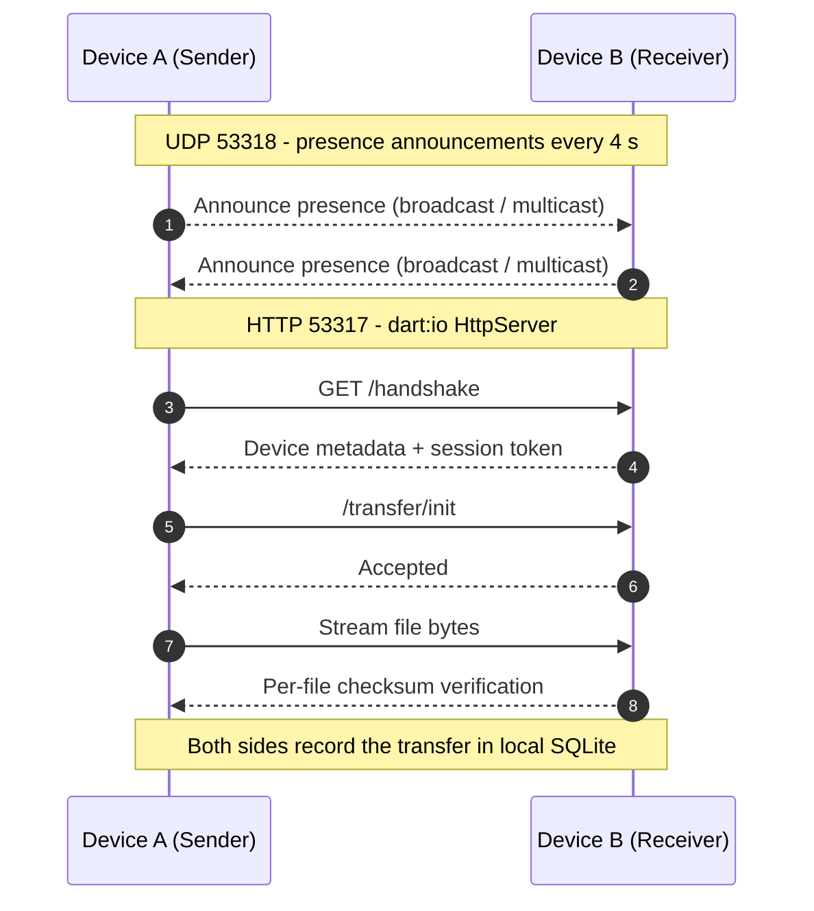

<div align="center">


# Najikify

### Private peer-to-peer file transfer for your local network

Move files and folders directly between Linux desktops and Android devices.
No cloud. No accounts. No third-party uploads. Your data never leaves your Wi-Fi.

<br />

[](https://github.com/ankitkhatrik6/najikify/actions/workflows/ci.yml)
[](https://github.com/ankitkhatrik6/najikify/actions/workflows/release.yml)
[](https://github.com/ankitkhatrik6/najikify/releases/latest)
[](https://flutter.dev)
[](https://dart.dev)
[](https://github.com/ankitkhatrik6/najikify/releases/latest)
[](https://github.com/ankitkhatrik6/najikify/releases/latest)
[](#supported-platforms)
[](LICENSE)
[](CONTRIBUTING.md)
<br />

[Download](#downloads) &nbsp;|&nbsp; [Quick Start](#quick-start) &nbsp;|&nbsp; [How It Works](#how-it-works) &nbsp;|&nbsp; [Development](#development) &nbsp;|&nbsp; [Troubleshooting](#troubleshooting)

</div>

---

## Table of Contents

- [Overview](#overview)
- [Features](#features)
- [Supported Platforms](#supported-platforms)
- [Downloads](#downloads)
- [Installation](#installation)
- [Quick Start](#quick-start)
- [How It Works](#how-it-works)
- [Network Requirements](#network-requirements)
- [Development](#development)
- [Continuous Integration](#continuous-integration)
- [Project Structure](#project-structure)
- [Technology Stack](#technology-stack)
- [Troubleshooting](#troubleshooting)
- [FAQ](#faq)
- [Contributing](#contributing)
- [Security](#security)
- [License](#license)
- [Author](#author)

---

## Overview

Najikify turns any two devices on the same Wi-Fi or LAN into a direct transfer channel. It discovers peers automatically, streams files over HTTP with checksum verification, and keeps a local history of everything sent and received.

Everything happens device-to-device. There is no server in the middle, nothing to sign up for, and nothing uploaded anywhere.

## Features

| Feature | Description |
|---------|-------------|
| **No cloud, no accounts** | Transfers are strictly device-to-device. Nothing is uploaded to any third party. |
| **Automatic discovery** | Peers on the same subnet find each other over UDP multicast/broadcast. No IP addresses to type. |
| **QR pairing** | Optional trust-on-first-use pairing via QR code, building a persistent trusted-device list. |
| **Verified transfers** | Files stream over HTTP with per-file checksums and configurable conflict handling. |
| **Live progress** | Progress, speed and ETA update in real time on both the sender and the receiver. |
| **Local history** | Every transfer is recorded in a local SQLite database on each device. |
| **Cross-platform** | Linux desktop and Android from a single Flutter codebase. |
| **Self-updating** | Checks GitHub Releases for newer builds, notifies on Android/Linux, and offers the download in-app. |
| **Community prompt** | Occasionally asks for a GitHub star — random, never nagging, closes itself after 5 seconds. |

## Supported Platforms

| Platform | Artifact | Build command |
|----------|----------|---------------|
| Linux (Debian/Ubuntu, x86-64) | `.deb` package | `bash packaging/linux/build_deb.sh` |
| Linux (Debian/Ubuntu, x86-64) | Portable bundle | `flutter build linux --release` |
| Android | Universal `.apk` | `flutter build apk --release` |
| Android | Per-ABI `.apk` (smaller) | `flutter build apk --split-per-abi --release` |

> [!TIP]
> **No local Android SDK required.** Every push builds the `.deb` and `.apk` in GitHub Actions. See [Downloads](#downloads).

## Downloads

Prebuilt artifacts are published automatically by GitHub Actions.

- **Latest release:** [releases/latest](https://github.com/ankitkhatrik6/najikify/releases/latest)
- **Artifacts from `main`:** [Actions > Build & Release](https://github.com/ankitkhatrik6/najikify/actions/workflows/release.yml), pick a run, then open **Artifacts**

| File | Platform |
|------|----------|
| `najikify-linux-<version>-amd64.deb` | Debian / Ubuntu (x86-64) |
| `najikify-linux-<version>-amd64.tar.gz` | Portable Linux bundle |
| `najikify-android-<version>.apk` | Universal Android APK |

## Installation

### Linux (Debian / Ubuntu)

Download the `.deb` from [Releases](https://github.com/ankitkhatrik6/najikify/releases/latest), then install it and open the required firewall ports so peers can discover and reach each other:

```bash
sudo apt install ./najikify-linux-<version>-amd64.deb

sudo ufw allow 53317/tcp
sudo ufw allow 53318/udp
```

Launch **Najikify** from your application menu (under *Network* / *File Transfer*), or from a terminal:

```bash
najikify
```

<details>
<summary><b>Building the <code>.deb</code> yourself</b></summary>

<br />

```bash
sudo bash packaging/linux/install_deps.sh   # clang, cmake, ninja, pkg-config, GTK3, SQLite dev
bash packaging/linux/build_deb.sh           # -> build/najikify-linux-<version>-<arch>.deb
```

</details>

### Android

1. Download `najikify-android-<version>.apk` from [Releases](https://github.com/ankitkhatrik6/najikify/releases/latest).
2. Open it on the device and allow installation from unknown sources when prompted.
3. Grant camera (QR pairing) and storage/media permissions on first launch.

> [!NOTE]
> Release APKs are signed with a dedicated release key (never the debug key),
> so skipping ahead normally installs cleanly over the previous release. The
> one exception: builds up to **1.0.2** were debug-signed, and Android refuses
> to upgrade those in place (“app not installed as package conflicts with an
> existing package”) — uninstall once, install the new version, and every later
> update installs normally. Details and the certificate fingerprint:
> [`docs/RELEASE_SIGNING.md`](docs/RELEASE_SIGNING.md).

## Quick Start

```bash
# 1. Connect both devices to the same Wi-Fi / LAN

# 2. Start Najikify on both
najikify

# 3. The other device appears under "Devices" on the Home tab within seconds

# 4. Click "Send Files" (or "Send Folder"), pick a device, then Accept on the receiver
```

## How It Works



1. **Discovery.** Each peer broadcasts a presence announcement on UDP `53318` every 4 seconds and drops peers that stay silent for 30 seconds. Peers with an in-flight transfer are pinned, so they stay listed while bytes are flowing and for a full freshness window afterwards.
2. **Handshake.** The sender calls `/handshake` on the receiver's HTTP server to exchange device metadata and obtain a session token.
3. **Transfer.** Files stream over HTTP to the receiver. Progress, speed and ETA update live on both ends.
4. **Verification.** Checksums are compared per file. Conflicts resolve via replace, keep-both, or skip.
5. **History.** Each side records the transfer in a local SQLite database (`sqflite` on Android, `sqflite_common_ffi` on desktop).

### Ports

| Port | Protocol | Purpose |
|------|----------|---------|
| `53317` | TCP | HTTP file streaming |
| `53318` | UDP | Peer discovery and presence announcements |

## Network Requirements

For a successful transfer, make sure that:

- Both devices are on the **same subnet**.
- **Client / AP isolation is disabled** on the router or access point. It blocks device-to-device traffic.
- Firewalls allow **`53317/tcp`** and **`53318/udp`** on both devices.

## Development

### Prerequisites

| Requirement | Details |
|-------------|---------|
| **Flutter** | 3.47+ (stable) with Linux desktop enabled: `flutter config --enable-linux-desktop` |
| **Linux toolchain** | `clang cmake ninja-build pkg-config libgtk-3-dev libsqlite3-dev adb` |
| **Android** | Android SDK (platform 35+), build-tools, and JDK 17+ |

Install the Linux toolchain with the helper script and verify your setup:

```bash
sudo bash packaging/linux/install_deps.sh
flutter doctor
```

### Run and test

```bash
flutter pub get          # fetch dependencies
flutter test             # unit + widget test suite
flutter analyze          # static analysis
flutter run -d linux     # run on the Linux desktop
flutter run              # run on a connected Android device (adb devices)
```

### Build

```bash
flutter build linux --release            # Linux bundle   -> build/linux/x64/release/bundle/
bash packaging/linux/build_deb.sh        # Debian package -> build/*.deb
flutter build apk --release              # Android APK    -> build/app/outputs/flutter-apk/app-release.apk
bash packaging/android/build_apk.sh      # same, via helper script
```

## Continuous Integration

| Workflow | Trigger | Output |
|----------|---------|--------|
| [`ci.yml`](.github/workflows/ci.yml) | push / PR | `flutter analyze` + `flutter test` on every change |
| [`release.yml`](.github/workflows/release.yml) | push to `main`, tag `v*`, manual | `.deb`, portable `.tar.gz`, universal `.apk`; published to a GitHub Release on tags |

No local Android SDK or desktop toolchain is needed. The runners provide them.

## Project Structure

```text
najikify/
|-- lib/
|   |-- app/                 # App shell, routing, theming
|   |-- core/
|   |   |-- constants/       # App + network constants (ports, timeouts)
|   |   |-- errors/          # Typed exception hierarchy
|   |   `-- utils/           # Crypto, file, formatting, network helpers
|   |-- features/            # Screens: home, transfers, history, settings, pairing
|   |-- models/              # Device, Transfer, TransferFile, PairingSession
|   |-- services/            # Discovery, transfer server/client, DB, pairing, settings
|   |-- widgets/             # Reusable UI components
|   `-- main.dart            # Entry point + service bootstrap
|-- linux/                   # Linux runner (CMake, GTK)
|-- android/                 # Android runner (Gradle, manifest, resources)
|-- packaging/
|   |-- linux/               # .deb packaging + dependency installer
|   `-- android/             # APK build helper
|-- test/                    # Unit + widget tests
|-- assets/icons/            # Application icon
`-- .github/workflows/       # CI + release automation
```

## Technology Stack

| Area | Choice |
|------|--------|
| UI / framework | Flutter (Material 3) |
| State management | `provider` |
| HTTP server / client | `dart:io` `HttpServer`, `http` |
| Persistence | `sqflite` + `sqflite_common_ffi` (SQLite) |
| Discovery | `dart:io` `RawDatagramSocket` (UDP multicast/broadcast) |
| Security | `crypto`, `convert` (session tokens, checksums) |
| Platform info | `device_info_plus`, `network_info_plus` |
| Pairing | `qr_flutter`, `mobile_scanner` |
| File handling | `file_selector`, `desktop_drop`, `path_provider` |

## Troubleshooting

<details>
<summary><b>Devices don't see each other</b></summary>

<br />

- Confirm both are on the same subnet: `ip -brief address`
- Check the firewall on both machines:
  ```bash
  sudo ufw status | grep -E '53317|53318'
  ```
- Disable **AP / client isolation** on the router. This is the most common cause.
- On machines with several NICs (Wi-Fi + Ethernet), both devices must use the same network.

</details>

<details>
<summary><b>Transfer is rejected or times out</b></summary>

<br />

- Run the app from a terminal (`najikify`) to watch live logs.
- Verify the receiver is still running and the peer has not gone stale (30 s timeout).
- Large transfers may need the machine to stay awake.

</details>

<details>
<summary><b>“No devices found” right after a transfer finished</b></summary>

<br />

Peers used to be dropped after 12 s of silence, which could hide a device the
moment a transfer ended or during a brief Wi-Fi hiccup. **Fixed in v1.0.3**:

- A peer involved in an active transfer is pinned and never swept as stale.
- When a transfer finishes its `lastSeen` is refreshed, so it stays listed for
  another full 30 s window.
- QR-paired peers are restored from the local database, so the device list is
  never empty after a send even if UDP announcements were missed.
- Discovery re-probes 2 s after start-up, covering a lost first probe.

</details>

<details>
<summary><b>Progress stuck at 0%, or history showing the wrong percentage</b></summary>

<br />

**Fixed in v1.0.3.** The bar previously tracked only the file currently in
flight and the final snapshot could be written without the byte total, so a
finished multi-file transfer could read `0%`.

- Progress is now aggregated across **all** files in the transfer, so a
  multi-package send advances smoothly from 0 → 100%.
- Completion writes the full byte count, so a finished transfer always shows
  100% in Transfers and History.
- Live progress is mirrored into History (throttled to one write per 700 ms),
  so History tracks the transfer in near-real time instead of only updating at
  the end.
- Incoming transfers are persisted when they start, not only when they finish.

</details>

<details>
<summary><b>App version in Settings shows an old number</b></summary>

<br />

The Settings screen reads `AppConstants.appVersion` from
`lib/core/constants/app_constants.dart`, which is a separate constant from
`pubspec.yaml`. If it drifts, Settings shows the wrong version. **Fixed in
v1.0.3** — keep the two in sync when bumping a release (the constant now carries
a comment saying so).

</details>

<details>
<summary><b>Play Protect blocks the APK: “App blocked to protect your device”</b></summary>

<br />

> Play Protect hasn't seen an app from this developer before. It may be unsafe.

This is Play Protect's **“Uncommon”** category. **Fixed in v1.0.3** in two ways:

1. **Release APKs are now signed with a dedicated release key.** Earlier
   releases were signed with the shared Android debug key (`androiddebugkey`),
   a globally known untrusted identity — a direct trigger for this warning.
   Details and the certificate fingerprint: [`docs/RELEASE_SIGNING.md`](docs/RELEASE_SIGNING.md).
2. **Broad storage permissions were removed.** `MANAGE_EXTERNAL_STORAGE`
   (“all files access”), `READ_MEDIA_*` and `requestLegacyExternalStorage` are
   no longer declared — Najikify only writes to its own app directory and picks
   files through the system file picker, so it no longer looks like a
   high-risk storage app.

Verify a downloaded APK really is ours:

```bash
apksigner verify --print-certs najikify-android-<version>.apk
# SHA-256 must equal the fingerprint in docs/RELEASE_SIGNING.md
```

If your device still blocks the install, either tap **Install anyway** in the
dialog or switch off Play Protect scanning temporarily
(*Play Store → Profile → Play Protect → Settings*). A brand-new signing key can
still be reported as “uncommon” for the first installations while Google builds
up reputation for it.

</details>

<details>
<summary><b>“App not installed as package conflicts with an existing package” (Android)</b></summary>

<br />

Android refuses to install an update signed with a **different key** than the
installed build. Najikify releases up to **1.0.2** were signed with the shared
Android debug key; every release from **1.0.3** onwards shares one stable
release key. So:

- **1.0.2 (or older) → newer:** uninstall Najikify once, then install the new
  APK. Afterwards every update installs normally over the previous one.
- **1.0.3 → newer:** installs cleanly in place, no uninstall needed.
- Every release runs a CI check (`apksigner verify --print-certs`) that fails
  the build if the APK ever regresses to debug signing.

A different `applicationId` or a downgrade to an older `versionCode` produces
the same message — Najikify keeps both stable (`com.najikify.app`, strictly
increasing `versionCode`).

</details>

<details>
<summary><b>How do update checks and the “Do you like Najikify?” prompt behave?</b></summary>

<br />

Both work identically on **Linux and Android**:

- **Update available:** the app checks GitHub Releases at startup (throttled to
  once per 6 hours) and posts a system notification (Android notification /
  Linux `notify-send`, at most once per version). Tapping it, the Home banner,
  or *Settings → Check for Updates* opens the download.
- **“Do you like Najikify?” star prompt:** appears at most occasionally —
  never before the 5th launch, at most once every 14 days, only on a ~15%
  random roll, never while an update is waiting — and **closes itself after 5
  seconds**. *Star on GitHub* opens the repo; *Don't ask again* silences it
  for good.

</details>

<details>
<summary><b>Linux build fails: GTK / clang / cmake missing</b></summary>

<br />

```bash
sudo bash packaging/linux/install_deps.sh
flutter doctor     # "Linux toolchain" should be green
```

</details>

<details>
<summary><b>Android camera / QR scanner fails to start</b></summary>

<br />

If the scanner shows *"Camera failed to start: code genericError, message:
Attempt to invoke virtual method 'java.lang.Class java.lang.Object.getClass()'
on a null object reference"*, that came from R8 full mode (the Android release
default) removing ML Kit classes that ML Kit itself loads through reflection.
Debug builds were never affected. **Fixed in v1.0.2**, which ships the required
keep rules (`android/app/proguard-rules.pro`).

If it still happens on your device:

- Open **Settings → Apps → Najikify → Permissions** and allow **Camera**, then
  reopen the scanner.
- Make sure no other app is holding the camera (video call apps keep it locked).
- Use **Scan from gallery image**: screenshot the peer QR and pick it with the
  gallery button, no camera needed.
- Or use **Copy Link** on the peer device and paste the link into the scanner.

</details>

<details>
<summary><b>Android build: SDK or JDK errors</b></summary>

<br />

- Run `flutter doctor -v` and resolve the reported Android toolchain issues.
- JDK 17+ is required. Confirm with `java -version`.
- If your machine struggles with Android builds, let [CI](#continuous-integration) produce the APK instead.

</details>

## FAQ

<details>
<summary><b>Does Najikify need an internet connection?</b></summary>

<br />

No. Both devices only need to share a local network. Nothing is sent to any cloud service.

</details>

<details>
<summary><b>Are transfers encrypted?</b></summary>

<br />

Not at the transport level. Transfers use plain HTTP on the LAN, protected by per-session tokens and checksum verification. See [Security](#security).

</details>

<details>
<summary><b>What happens if a file already exists on the receiver?</b></summary>

<br />

Conflicts are handled per your setting: replace, keep both, or skip.

</details>

## Contributing

Contributions are welcome.

1. Fork the repository and create a branch: `git checkout -b feat/my-change`
2. Keep changes focused and add tests where it makes sense.
3. Ensure the checks pass locally:
   ```bash
   flutter analyze && flutter test
   ```
4. Open a pull request. CI verifies your branch automatically.

Keep code consistent with the existing architecture (`lib/services` for logic, `lib/features` for UI) and document any new network behaviour.

## Security

> [!WARNING]
> Najikify is designed for **trusted local networks**. Discovery and transfers use plain HTTP on the LAN, protected by per-session tokens and checksum verification. This is **not** transport encryption. Do not use it over untrusted or public networks.

To report a vulnerability, open a [private security advisory](https://github.com/ankitkhatrik6/najikify/security/advisories/new) instead of a public issue.

## License

Released under the [MIT License](LICENSE).

## Author

Designed and developed by **Ankit Khatri KC**, a BSc CSIT student and full-stack developer based in Kathmandu, Nepal.

[](https://github.com/ankitkhatrik6)
[](https://ankitak.com.np)
[](https://instagram.com/21ank1t)

---

<div align="center">

Built with [Flutter](https://flutter.dev). Your files stay on your network.

</div>
